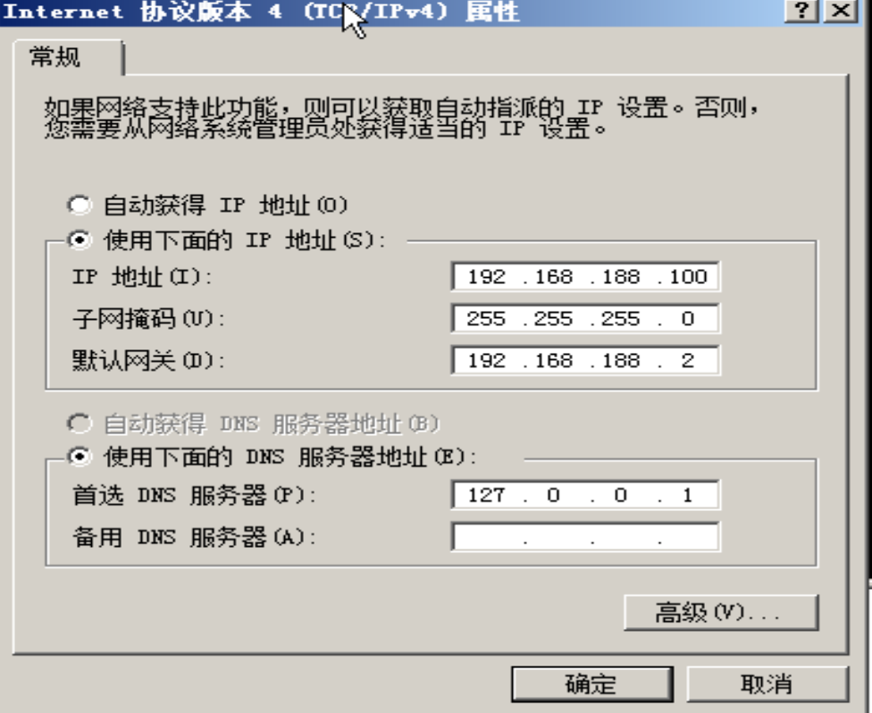
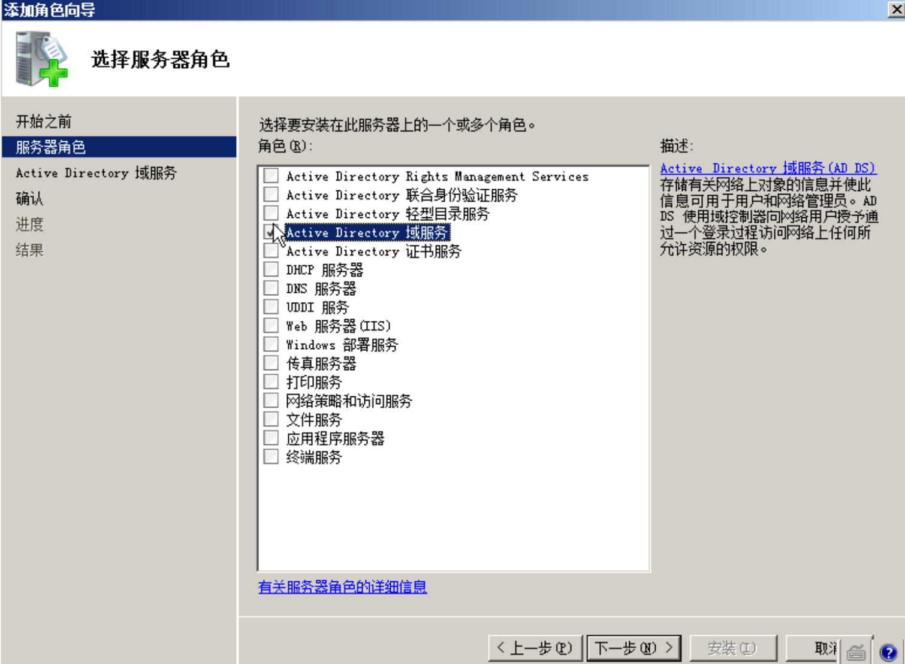
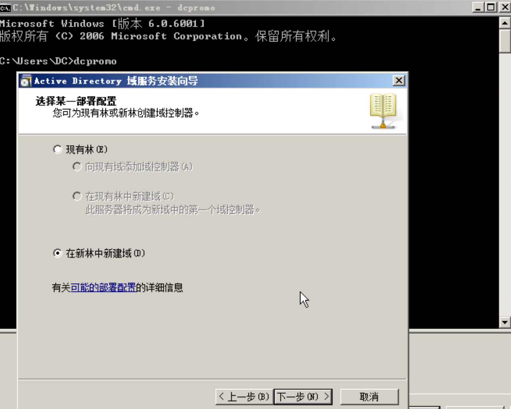
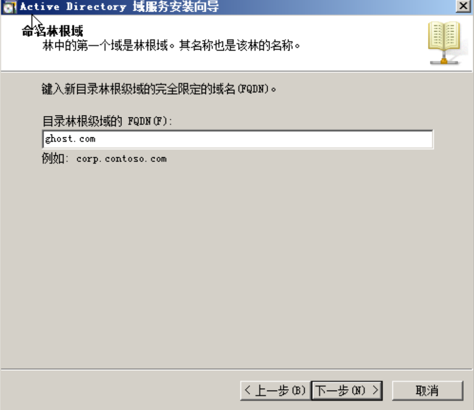
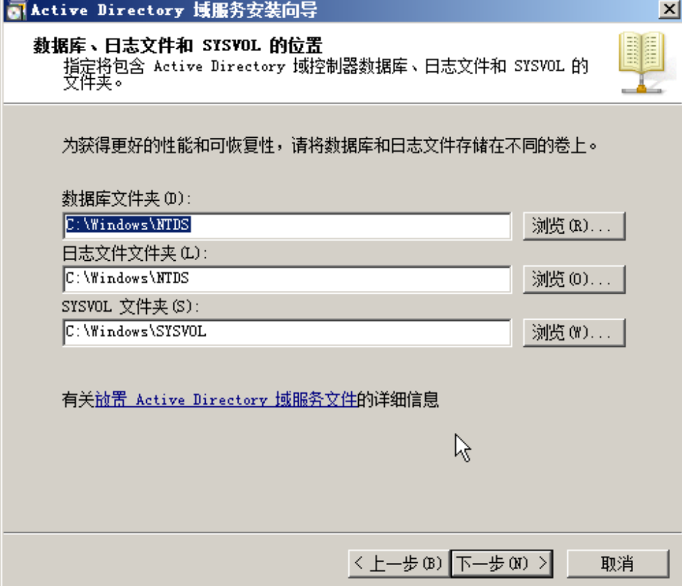
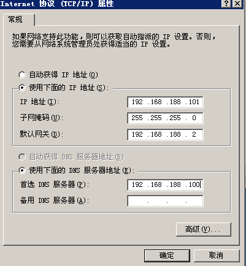
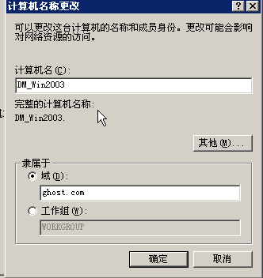

内网Learn

[toc]

# 1.名词解释

工作组、域、域控制器（DC）、父域、子域、域树、域森林、活动目录（AD）、DMZ、域内权限等

## 工作组

将不同的计算机按功能列入到不同的工作组中。工作组没有集中管理的作用，工作组中所有的计算机都是对等的。工作组不受密码保护。一个账户只能登陆到一台计算机。每一台计算机都在本地存储用户的帐户。

工作组的正规解释：在一个大的单位内，可能有成百上千台电脑互连组成局域网，如果这些电脑不分组，可想而知有多么混乱，要找一台电脑很困难。为了解决这一问题，就有了“工作组”这个概念，将不同的电脑一般按功能（或部门）分别列入不同的工作组中。

每台计算机都是对等的，`a`机器不能登录`b`机器。

## 域

[域，域树，域林，根域](https://blog.51cto.com/angerfire/144123)


# 2.域搭建

>   DC: win2008 ，密码Admin123
>   DM: win2003
>   DM: winxp

DC2008：

网络配置



添加服务器角色：



配置域服务(在administrator用户下。。)：

dos下：`dcpromo`



提示错误的话，管理员cmd`net user administrator /passwordreq:yes`


设置林根域：

林就是在多域情况下形成的森林,根表示基础,其他在此根部衍生



域数据存放的地址：



密码还是设置为Admin123!

接下来就是配置win2003和xp，都和08差不多

配置的dns要设置为主域控的ip：192.168.188.100





# 3.端口转发&边界代理

## 端口转发

尝试几个常用的

win：lcx

```
监听1234端口,转发数据到2333端口
本地:lcx.exe -listen 1234 2333

将目标的3389转发到本地的1234端口
远程:lcx.exe -slave ip 1234 127.0.0.1 3389
```

netsh
只支持tcp协议

```
添加转发规则
netsh interface portproxy set v4tov4 listenaddress=192.168.206.101 listenport=3333 connectaddress=192.168.206.100 connectport=3389
此工具适用于，有一台双网卡服务器，你可以通过它进行内网通信，比如这个，你连接192.168.206.101:3388端口是连接到100上面的3389

删除转发规则
netsh interface portproxy delete v4tov4 listenport=9090

查看现有规则
netsh interface portproxy show all

xp需要安装ipv6
netsh interface ipv6 install
```

linux :

portmap

```
监听1234端口,转发数据到2333端口
本地:./portmap -m 2 -p1 1234 -p2 2333

将目标的3389转发到本地的1234端口
./portmap -m 1 -p1 3389 -h2 ip -p2 1234
```

iptables

```
1、编辑配置文件/etc/sysctl.conf的net.ipv4.ip_forward = 1

2、关闭服务
service iptables stop

3、配置规则
需要访问的内网地址：192.168.206.101
内网边界web服务器：192.168.206.129
iptables -t nat -A PREROUTING --dst 192.168.206.129 -p tcp --dport 3389 -j DNAT --to-destination 192.168.206.101:3389

iptables -t nat -A POSTROUTING --dst 192.168.206.101 -p tcp --dport 3389 -j SNAT --to-source 192.168.206.129

4、保存&&重启服务
service iptables save && service iptables start
```

## socket代理

Windows：xsocks，进行代理后，在windows下推荐使用Proxifier进行socket连接，规则自己定义

linux：

进行代理后，推荐使用proxychains进行socket连接

kali下的配置文件：
/etc/proxychains.conf
添加一条：socks5 	127.0.0.1 8888

然后在命令前加proxychains就进行了代理

```
proxychains curl 192.168.111111
```

## 基于http的转发与socket代理(低权限下的渗透)

